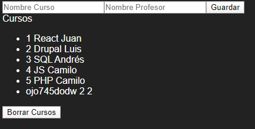
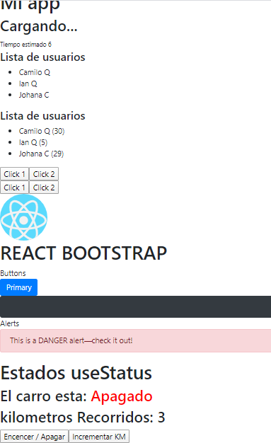

[`Volver`](../index.html)

# REACT JS
###### Tags: `curso` `menu`

Libreria JavaScript OpenSource diseñada para crear interfaz de usuarios

- [`React`](#React-JS)
	- [Herramientas Sugeridas](#herramientas-sugeridas) 
	- [Iniciar SPA](#iniciar-spa)
	- [Iniciar MPA](#iniciar-mpa)
- [`Componentes`](#Componentes) 
	- [Estructura componentes](#Estructura-componentes) 
	- [Escritura de componente](#Escritura-de-componente) 
	- [Ejemplo SPA](#Ejemplo-SPA) 
	- [Ejemplo MPA](#Ejemplo-MPA)
	- [Simular carga de datos](#Simular-carga-de-datos)
- [`Props`](#PROPS) 
	- [Básicos](#basicos) 
	- [Objetos](#objetos) 
	- [Arreglos](#arreglos) 
	- [Funciones](#funciones) 
	- [Funciones con parámetros](#Funciones-con-parametros) 
	- [Imágenes SVG](#Imágenes-SVG)
- [`Implementar Boostrap`](#Implementar-Boostrap)
- [`useState`](#useState)
- [`useEffect`](#useEffect)
- [`Eventos`](#Eventos)
- [`PropsTypes`](#PropsTypes)
- [`Paso a producción`](#Paso-a-producción)
- [`Ejemplo`](#Ejemplo)
- [`Proyectos con código Ejemplo`](#Proyectos-con-código-Ejemplo)
- [`React Routes`](#React-Routes)


## HERRAMIENTAS SUGERIDAS

[`Menu`](#)

- **Visual Studio Code**: Ide de desarrollo
- **nodeJS**: [`descargar`](https://nodejs.org/dist/latest-v10.x/)

- **React Developer Tools (Extensión Chrome)**:

	- Inspectos de elementos -> Componentes.  
	- Mostrara la estructura de componentes del proyecto.  
	- Al darle click a componente específico - Muestra los props del componente  

- **Yarn - npm**: Empaquetador de código [`descargar`](https://classic.yarnpkg.com/es-ES/)

	Descargar .msi e instalar 
	
  | Comando | Descripcion |
  | -------------------------------------- | ---------------------------------- |
  | yarn --version | versión actual yarn |
  | yarn start | Levantar servicio de app con yarn |
  | npm start | Levantar servicio de app con npm |
  | npx create-react-app my-app | Crear Aplicación global por yarn |
  | npm install -g create-react-app my-app | Crear Aplicación global por npm |
  | npm uninstall -g create-react-app | Eliminar Aplicación global por npm |
  
  Librerías para agregar por empaquetador
  
  | Comando | Descripcion | Importación |
  | -------------------------------------- | ---------------------------------- | ----------------------------- |
  | yarn add uid | Librería para control de ID alfanumérico | import uid from "uid" |
  | yarn add jquery | Librería jquery | import $ from "jquery" |
  

## INICIAR SPA

[`Menu`](#)

Tener en cuenta:

- nombre-app no puede tener mayúsculas

	```bash
		npx create-react-app nombre-app
	```

- El comando generará la siguiente estructura
  | Directorio-Archivo | Descripcion |
  | ------------------ | --------------------------------------------------------------------------------------- |
  | node*modules | Dependencias, con \_yarn install* se reinstalan todas |
  | .gitIgnore | Archivos o carpetas a omitir en subida a repositorio |
  | package.json | Configuración proyecto - nombre - version - dependencias - scripts (yarn start - build) |
  | public | Ficheros públicos - iconos - manifest (base_url - thema) - index |
  | src | Aplicación index.js (Principal), componentes |

## INICIAR MPA

[`Menu`](#)

Tener en cuenta llamar las siguientes librerias

- react.js
- react-dom.js (Versión superior a 14)
- babel-standalone
- adicionalmente en el script **language="text/babel"**

```html
	<div id="appReact"></div>
	<script src="https://cdnjs.cloudflare.com/ajax/libs/react/16.13.1/umd/react.production.min.js"></script>
	<script src="https://cdnjs.cloudflare.com/ajax/libs/react-dom/16.13.1/umd/react-dom.production.min.js"></script>
	<script src="https://cdnjs.cloudflare.com/ajax/libs/babel-standalone/6.26.0/babel.min.js"></script>
	<script type="text/babel" src="app.js"></script>
```

```javascript
	class MyApp extends React.Component {
	  render() {
		return (
		  <div>
			<h1 className="text"> HOLAMUNDO {this.props.name} </h1>
		  </div>
		);
	  }
	}

	// document.getElementById("appReact")      // Más Rápido que  document.querySelector("#appReact")
	ReactDOM.render(<MyApp name="Camilo" />, document.getElementById("appReact"));
```

## COMPONENTES

[`Menu`](#)

### Estructura componentes

1. Componentes en UpperCamelCase
2. Los elementos se cierran como XML </ >
3. Se puede agregar código Javascript en {}
4. Importación de React: **import React from "react"** (Solo desde empaquetador (npm, webpack, creatreactpack))
5. Siempre va a exportar y renderizar

   ```javascript
   	// Exportar en misma función (Sugerido)
   	export default function Loading() { ... };

   	// Exportar posterios a función
   	function Loading() { ... };
   	export default Loading;
   ```


6. Atributos HTML soportados en JSX

   - class => className
   - acceptchartset => acceptChartset
   - accesskey => accessKey
   - for => htmlFor
   - ![n2][img3]

7. Tipos de componentes
   - Stateless: Componentes de presentación (Sugerido - Mejora renderización) 
		- Solo muestran información 
		- Ej. Header - footer - NO tiene Estado
   - Stateful: Componentes Contenedores 
		- Encapsulan lógica de la aplicación 
		- Proporcionan propiedades 
		- Orientados a funcionaidad de la aplicación 
		- Tiene estado
		- Ejemplo: menú dinámico
		- Contenido dinámico
   
8. Partes
   - Render(): Renderizar html a navegador
   - Props(): Propiedades
		- Paso de datos entre componentes padres e hijos
		- Inmutables, una vez definidas no cambian
	- PropTypes: Tipología de variable y si son obligatorios
		- PropTypes.array -> array
		- PropTypes.bool -> bolean
		- PropTypes.func -> Función
		- PropTypes.number -> Número
		- PropTypes.object -> Objeto
		- PropTypes.string -> Texto
	- DefaultProps: Valor por defecto
	- state: Estado
		- El estado es propio del componete (No hereda)
		- Mutable
		.setState(): Cambiar el estado de un componente
	- Synthetic Events: Eventos Sintéticos
		- se nombran con camelCase (onClick) 
		- Eventos se disparan de hijo a padre (capturable)
		- El padre es quien captura el evento 
		- autobinding - this.eventClick = this.eventClick.bind(this); (Hace relación)

9. Ciclo de vida
	- Fase de Montaje
		- **componentWithMount()**: Se ejecuta solo una vez antes del primer render
		- **componentDidMount()**: Se ejecuta después del primer render.
			- Ideal para peticiones Ajax, librerias externas, eventos. 
			- Se ejecuta primero los hijos antes del padre.
			
			````javascript
				// index.jsx
				fetchData() {
					console.log('holamundo');
				}
				componentDidMount() {
					this.fetchData();
				}
			````
			
	- Fase de actualización
		- **componentWillReceiveProps(nextProps)**: Cuando el componente recibe nuevas propiedades
			- No se ejecuta con el primer render()
			- Recibe las nuevas propiedades, y es util para actualizar estados
		- **componentWillUpdate(nextProps, nextState)**: Cuando el componente vaya a renderizarse con nuevas propiedades
			- No se ejecuta con el primer render()
			- no usar setState(), puede generar un bucle infinito
		- **shouldComponentUpdate(nextProps, nextState)**: Ejecuta antes de renderizar
			- No se ejecuta con el primer render()
		- **componentDidUpdate(prevProps, preState)**: Se ejecuta después de renderizarse recibe parametros antiguos a la actualización
	- Fase de desmontaje
		- **componentWillUnmount(prevProps, preState)**: Se ejecuta cuando se elimina del DOM un componente
			- Util para eliminar listeners, eventos, referencias al DOM
10. Útilidades adicionales		
	- Componentes dinámicos: Componentes que varian en base a la información que reciben por PROPS, y solo pintan información.
	- Anidamiento de vistas: Util para reutilizar código.
	- Encapsulamiento de librerías.
	

			
### Escritura de componente

[`Menu`](#)

- JXS y EcmaScript ES6 (Sugerido)

```javascript
	// Componente con Estado 
	class ComponentStateFul extends React.Component { 
		constructor(...props) { 
		super(...props); // Constructor del padre 
		this.state = {...} } render () { ... } 
	}); 
		
	// Afuera de la definición de las clases 
	ComponentStateFul.propTypes = {...} 
	ComponentStateFul.defaultProps = {...} 
	export default ComponentStateFul; 
	
	------------------------------------------------ 
	
	// Componente sin Estado (Función) - return y {} 
	const ComponentStateLess = (props) => { return (<div>test</div>) }; 
	export default ComponentStateLess; 
	
	------------------------------------------------ 
	
	// Componente sin Estado (HTML) - solo () 
	const ComponentStateLess = (props) => ( <div>test</div> ); 
	export default ComponentStateLess;
```
	
		
- Javascript

```javascript
	// Generar estructura a partir de JS Nativo
	// Es necesario generar etiqueta por etiqueta por medio del createElement
	var image = React.createElement(
	"img",
	{ src: "assets/imageSVG.svg", className: "test", width: 200 },
	null
	),
	title = React.createElement(
	"figcaption",
	{ clasName: "textFigCaption" },
	"React"
	),
	logo = React.createElement("figure", { clasName: "logo" }, [image, title]);

      	ReactDOM.render(logo, document.getElementById("appReactJS"));
```

```html
	<!-- HTML generado -->
	<div id="appReactJS">
		<figure clasname="logo">
			
			<figcaption clasname="textFigCaption">React</figcaption>
		</figure>
	</div>
```

- JXS y EcmaScript ES5

- JXS y EcmaScript ES7

	```javascript	
		// Componente con Estado 
		class ComponentStateFul extends React.Component { 
			static propTypes = {...} // Es la diferencia con ES6 
			static defaultProps = {...} 
			state = {...} 
			constructor(...props) { 
				super(...props); // Constructor del padre 
			} 
			
			render () { ... } 
		}); 
		
		----------------------------------------------------------
			
		// Componente sin Estado 
		const ComponentStateLess = (props) => {};`
	```

### Ejemplo SPA

[`Menu`](#)

```javascript
// Componente Loading.js
import React from "react";
export default function Loading() {
  return (
	<h2>Cargando...</h2>
  )
};

----------------------------

// App.js (Principal)
import React from "react";
import Loading from "./components/Loading"; // Importar Componente

function App() {
  return (
    <div className="App">
      <h1>Mi app</h1>
      <Loading /> // Llamado componente como etiqueta html
    </div>
  );
}
export default App;
```

### Ejemplo MPA

[`Menu`](#)

```javascript
// Ejemplo con retorno (Sencillo)
class Logo extends React.Component {
  render() {
    return (
      <figure clasname="logo">
        
        <figcaption clasname="textFigCaption">React</figcaption>
      </figure>
    );
  }
}

ReactDOM.render(<Logo />, document.getElementById("appReactJSX"));
```

### Simular carga de datos 

[`Menu`](#)

- desde const JS
	
```javascript
	// data/courses.js
	export const courses = [
	  { id: 1, name: "React", teacher: "Juan" },
	  { id: 2, name: "Drupal", teacher: "Luis" },
	];
	
	-------------------------------------------
	
	// components/index.jsx
	import { courses } from "../data/courses"; 	// Importar datos 
```
	
- desde JSON

```javascript
	// data/courses.json
	[
	  { "id": 1, "name": "React", "teacher": "Juan" },
	  { "id": 2, "name": "Drupal", "teacher": "Luis" },
	]
	
	-------------------------------------------
	
	// components/index.jsx
	import courses from "../data/courses.json";
```
	
- desde JSON con KEY

```javascript
	// data/coursesWithKey.json
	{
	  "courses": [
		{ "id": 1, "name": "React", "teacher": "Juan" },
		{ "id": 2, "name": "Drupal", "teacher": "Luis" }
	  ]
	}
	
	-------------------------------------------
	
	// components/index.jsx
	import {courses} from "../data/coursesWithKey.json";
```

El caso de asignar los datos se realizan desde el constructor 
- No requiere indicar la extensión cuando es **JS** o **JSX**

```javascript
	// components/index.jsx
	
	// Asignar data a variable
	class App extends Component {
		constructor(...props) {
			this.state = {
			  courses: courses,
			};
		}
	}
```


## PROPS

[`Menu`](#)

Propiedades, paso de parametros a componentes.
Inmutables: no se pueden modificar, solo lectura, en caso de necesidad de modificar asignar a variables y modificar la variable

Tipos de datos

- Datos Simples: numeros, textos
- Funciones:
- Objetos: Elementos de un json
- Array: Array de objetos
- Componentes

![Componentes][img1]

### Basicos

[`Menu`](#)

```javascript
// app.js
function App() {
	return (
		// Nombre parámetro a enviar
		<Loading text="Cargando app" />		// Texto
		<Loading text={99} />				  // Números
		<Loading text={true} />				// Boleanos
	);
}
-----------------------------

// Loading.js
export default function Loading(props) {
	const { text } = props; 	// Extrae valor específico

	return (
		<h2>{text}</h2>
	);
}
-----------------------------

```

### Objectos

[`Menu`](#)

```javascript
// app.js
function App() {

	// Variable a enviar tipo Objeto
	const ObjectText = {
		title: "Cargando...",
		time: 6
	};

	return (
		<Loading data={ObjectText} />				// Objecto
	);
}
-----------------------------

// Loading.js
export default function Loading(props) {
	const { data } = props; 	// Extrae valor específico

	return (
		<h2>{data.title}</h2>
		<small>Tiempo estimado {data.time}</small>
	);
}
```

### Arreglos

[`Menu`](#)

```javascript
// app.js
import ListUsers from "./components/ListUsers";
function App() {
  // Variable a enviar tipo Array de Objetos
  const users = [
    { name: "Camilo Q", age: "30" },
    { name: "Ian Q", age: "5" },
    { name: "Johana C", age: "29" },
  ];

  return (
    <div className="App">
      <ListUsers listUsers={users} />
    </div>
  );
}

// ListUsers.js
import React from "react";

export default function ListUsers(props) {
  const { listUsers } = props;

  return (
    <div>
      <h4> Lista de usuarios</h4>
      <ul>
        // Mapeo de arreglo por posición y asignación a variable name (Imprimir
        la posición)
        {listUsers.map((user, index) => (
          <li key={index}>
            {user.name} ({user.age})
          </li>
        ))}
      </ul>
    </div>
  );
}
```

### Funciones

[`Menu`](#)

```javascript
// app.js
function App() {
  // Función
  const showNameConsoleFunction = () => {
    console.log("Camilo Quijano");
  };

  return (
    // Envio de función a componente
    <div className="App">
      <Buttons fnShowName={showNameConsoleFunction} />
    </div>
  );
}

// Buttons.js
export default function Buttons(props) {
  const { fnShowName } = props;

  // Recibir función y relacionarla a evento CLICK
  return (
    <div>
      <button onClick={fnShowName}>Click</button>
    </div>
  );
}
```

### Funciones con parametros

[`Menu`](#)

```javascript
// app.js
function App() {
  // Función
  const showNameConsoleFunction = (name) => {
    console.log(name);
  };

  return (
    // Envio de función a componente
    <div className="App">
      <Buttons fnShowName={showNameConsoleFunction} />
    </div>
  );
}

// Buttons.js
export default function Buttons(props) {
  const { fnShowName } = props;

  // Recibir función y relacionarla a evento CLICK
  return (
    <div>
      <button onClick={() => fnShowName("Param1")}>Click</button>
      <button onClick={() => fnShowName("Param2")}>Click</button>
    </div>
  );
}
```

### Imágenes SVG

[`Menu`](#)

```javascript
// app.js
import { ReactComponent as ReactLogo } from "./assets/imageSVG.svg";

function App() {
  return (
    // Llamado componentes e incluirles estilos
    <div className="App">
      <ReactLogo style={{ width: 100, height: 100 }} />
    </div>
  );
}
```

### Implementar Boostrap

[`Menu`](#)

```bash
// Yarn
yarn add react-bootstrap bootstrap

// Npm
npm install react-bootstrap bootstrap
```

Importar estilos CSS

```javascript
// index.js
import "bootstrap/dist/css/bootstrap.min.css";
import "./index.css";
```

Importar Componentes boostrap

```javascript
// Por componentes
import Button from "react-bootstrap/Button";

// Extraer componente específico
import { Button } from "react-bootstrap";
import { Accordion, Card } from "react-bootstrap";

function App() {
  return (
    <div className="App">
      <h1>Mi app</h1>
      // Buttons
      <Button
        variant="dark"
        size="lg"
        block
        onClick={() => {
          console.log("here HOLA");
        }}
      >
        Dark onClick
      </Button>
      // Alerts
      <Alert variant="danger">This is a DANGER alert—check it out!</Alert>
    </div>
  );
}
```

### useState

[`Menu`](#)

```javascript
// Importar useState
import React, { useState } from "react";

export default function Car() {
  // Primero la variables que guarda valor del estado, Función que va a actualizar el estado
  const [started, setStarted] = useState(false); // Bool
  const [countKm, setCountKm] = useState(0); // Número

  // Función para mostrar texto dependiendo el estado
  const checkStateCar = () => {
    return started ? (
      <span style={{ color: "green" }}>Encendido</span>
    ) : (
      <span style={{ color: "red" }}>Apagado</span>
    );
  };

  // Función que incrementará Km siempre y cuando el vehiculo este encendido
  const incrementKm = (num) => {
    if (started) {
      setCountKm(countKm + num);
    } else {
      alert("Coche apagado");
    }
  };

  return (
    <div>
      <h2>El carro esta: {checkStateCar()}</h2>
      <h2>kilometros Recorridos: {countKm}</h2>
      // Actualizar variables tipo BOOL
      <button
        onClick={() => {
          setStarted(!started);
        }}
      >
        Encencer / Apagar
      </button>
      // Actualizar variables tipo NUMERO
      <button
        onClick={() => {
          incrementKm(1);
        }}
      >
        Incrementar KM
      </button>
    </div>
  );
}
```

### useEffect

[`Menu`](#)

```javascript
// Importar useEffect
import React, { useState, useEffect } from "react";

export default function Car() {
  const [started, setStarted] = useState(false);

  // Actualizará el titulo del dom al actualizar la variable del useState
  // Importante pasar por parámetros las variables que se van a usar internamente en useEffect
  useEffect(() => {
    // Actualizar el titulo partiendo del valor de la variable
    document.title = `Coche ${started}`;
  }, [started]);
}
```

### Eventos

[`Menu`](#)

```javascript
// App.js
import React, { Component } from "react";
import CoursesList from "./CoursesList";

class App extends Component {

	// Constructor del componente
	// Inicializar eventos
	constructor(...props) {

		// Estandar de react para control de eventos (autobinding)
		this.handleOnAddCourse = this.handleOnAddCourse.bind(this);
	}

	// Funcion que controla evento
	handleOnAddCourse(e) {
		e.preventDefault();
		console.log('Here');
	}

	// Paso de la función del evento por parámetro
	render() {
		return (
		  <div>
			<CoursesAdd
			  onAddCourse={this.handleOnAddCourse}
			/>
		  </div>
		);
	}
}

---------------------------------------------------------

// CoursesAdd.jsx (Componente de formulario)
import React from "react";

const CoursesAdd = (props) => (
	// Asociación de evento a la función
  <form onSubmit={props.onAddCourse}>
    ...
  </form>
);

export default CoursesAdd;
```

### PropsTypes

[`Menu`](#)

Indicador de tipos de datos de cada uno de los elementos de los estados y si es obligatorio 

```javascript
	import PropTypes from "prop-types"; // Importar prop-types

	class App extends Component {
	  constructor(...props) {
		this.state = {
		  courses: [
			{ id: 1, name: "React", teacher: "Juan" },
			{ id: 2, name: "Drupal", teacher: "Luis" },
			{ id: 3, name: "SQL", teacher: "Andrés" },
		  ],
		};
	}
	
	// Indicar los tipos de datos de cada elementos
	App.propTypes = {
	  id: PropTypes.number.isRequired,
	  name: PropTypes.string.isRequired,
	  teacher: PropTypes.string.isRequired,
	};
```

### DefaultTypes

[`Menu`](#)

```javascript

	class App extends Component {
		// Evento Sintáctico
		handleOnAddCourse(e) {
			...
			// En caso de venir un valor vacio se pone el valor por defeto
			let form = e.target;
			let course = {
			  id: form.id.value,
			  name: form.name.value ? form.name.value : App.defaultProps.name,
			  teacher: form.teacher.value ? form.teacher.value : App.defaultProps.teacher,
			};
			...
		}
	}
	
	// Indicar los valores por defecto
	App.defaultProps = {
	  name: "Curso Desconocido",
	  teacher: "Profesor Desconocido",
	};
```


## Paso a producción

[`Menu`](#)

```bash
// Yarn
yarn build

// Npm
npm build
```

Servidor para paso a producción proyectos pequeños

https://www.netlify.com/

Se debe pegar los ficheros generados en la directorio build.

Se cargan a netlify (Carpeta build)

## React Routes

[`Menu`](#)

Colección de componentes de navegación.

		
## Ejemplo

[`Menu`](#)

Ejemplo incluye

- Listado de cursos
- Formulario de agregar curso (A arreglo de objetos)
- Evento submit de Formulario
- Paso de parámetros
- Prop-types
- Ciclo de vida
- Uso de librerias

```javascript
//Courses.js
export const courses = [
  { id: 1, name: "React", teacher: "Juan" },
  { id: 2, name: "Drupal", teacher: "Luis" }
];

// App.js
import React, { Component } from "react";
import PropTypes from "prop-types";
import CoursesList from "./CoursesList";
import { courses } from "../data/courses";

// Librerias 
import $ from "jquery";

class App extends Component {

	// Constructor del componente
	// Incializa listado de variables con variación de estado (this.state)
	constructor(...props) {
		super(...props);
		this.state = {
			  courses: [],
		};

		// Estandar de react para control de eventos
		this.handleOnAddCourse = this.handleOnAddCourse.bind(this);
	}

	// Función de carga información | Ejemplo de uso de JQUERY
	fetchData() {
		//setTimeout(() => { this.setState({ courses: courses }); }, 2000);
		$("#root")
		  .fadeOut(3000, () => {
			this.setState({ courses: courses });
		  })
		  .fadeIn();
	}

	// Ciclo de vida - Fase de Montaje, despúes del primer render 
	// Carga la información posterior al primer render
	componentDidMount() {
		this.fetchData();
	}
  
	// Funcion que controla evento
	handleOnAddCourse(e) {
		e.preventDefault();

		// Lectura del formulario que genera el eventos
		// Estructuración de formulario a objeto con estrucura del listado de objectos
		// En caso de que no sea requerido, se asigna el valor por defecto
		let form = e.target;
		let course = {
		  id: form.id.value,
		  name: form.name.value ? form.name.value : App.defaultProps.name,
		  teacher: form.teacher.value ? form.teacher.value : App.defaultProps.teacher,
		};

		// Agregar a variable de estados estructuración de nuevo objeto
		this.setState({
		  courses: this.state.courses.concat([course]),
		});

		form.reset(); // Resetear formulario
	}

	render() {
		if (!this.state.courses.length) { 
			return (
				<div>
				  <p>No hay Cursos</p>
				  <button onClick={this.fetchData}>Cargar Cursos</button>
				</div>
			);
		} else {
			// Paso de la función del evento por parámetro
			return (
			  <div>
				<CoursesAdd
				  onAddCourse={this.handleOnAddCourse}
				/>
			  </div>
			);
		}
	}
}

// Proptypes
App.propTypes = {
  id: PropTypes.number.isRequired,
  name: PropTypes.string.isRequired,
  teacher: PropTypes.string.isRequired,
};

// Indicar los valores por defecto
App.defaultProps = {
  name: "Curso Desconocido",
  teacher: "Profesor Desconocido",
};

export default App;

---------------------------------------------------------

// CoursesAdd.jsx (Componente de formulario)
import React from "react";

const CoursesAdd = (props) => (
	// Asociación de evento a la función
  <form onSubmit={props.onAddCourse}>
    <input type="text" name="name" required placeholder="Nombre Curso" />
    <input type="text" name="teacher" required placeholder="Nombre Profesor" />
    <input type="hidden" name="id" value={Math.floor(Math.random() * 100)} />
    <input type="submit" value="Guardar" />
  </form>
);

export default CoursesAdd;
```

## Proyectos con código Ejemplo

Clonar proyecto github

para cualquiera de los proyectos una vez clonado

- npm install: Para instalar dependencias de los proyectos	 
- git clone https://github.com/CamiloQuijano/cursoReact.git

		- project car:
			- Encender - Apagar
			- Sumar Kilometros
			- Listado
			- Eventos
			- Boostrap
			- Imagenes
	
		- project courses:
			- Listado de cursos	
			- Agregar cursos
		
</img>
</img>	
		
[`Menu`](#)

[img1]: react/assets/reactProps.PNG "Componentes"
[img3]: react/assets/reactAttrSupport.PNG "AttributosSoportados"
